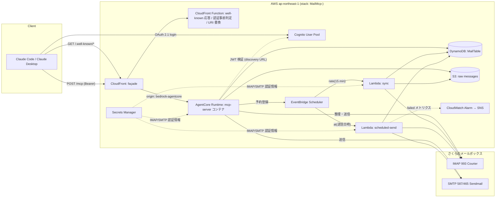

# Design: mcp-mail-manager

> requirements.md の各要件をどう実現するかの技術仕様。
> 憲法（AWS 前提 / サーバレス優先 / TDD）に従う。憲法から外れる判断は ADR を参照する。

## 1. アーキテクチャ概要



- MCP サーバ本体は AgentCore Runtime 上の ARM64 コンテナ（Node.js 22）で動き、`0.0.0.0:8000/mcp` をステートレス Streamable HTTP で待ち受ける（[ADR-0001](adr/0001-mcp-hosting-agentcore-runtime.md)）。トークン検証は AgentCore の JWT 認可が行う。
- façade（CloudFront + CloudFront Function）は well-known 2 本を静的 JSON で返し、トークン無し / 期限切れの `POST /mcp` には自身の PRM を指す 401 を返し、それ以外の `POST /mcp` を AgentCore の呼出 URL へ転送する。Lambda も S3 も持たない。Claude に登録する URL は `https://<distribution>.cloudfront.net/mcp`。
- MCP コンテナと 2 つの Lambda（sync / scheduled-send）は同一リポジトリの共通ライブラリ `src/core` を共有する。Lambda は `NodejsFunction`（esbuild）、コンテナは Dockerfile（esbuild で単一ファイルにバンドル）で配布する。コンテナイメージ（ARM64）は `@cdklabs/deploy-time-build` の `ContainerImageBuild` がデプロイ時に CodeBuild（ARM ランナー）でビルドして ECR へ push する（[ADR-0005](adr/0005-arm64-image-deploy-time-build.md)）。ローカル・CI に QEMU / buildx は不要。
- Lambda・AgentCore Runtime とも VPC に置かない（NAT Gateway を避ける。AgentCore は PUBLIC ネットワークモード）。IMAP / SMTP へはインターネット経由で TLS 接続する。
- さくらのメールボックス（Courier-IMAP / Sendmail）の制約。2026-09-19 に実サーバへ接続して確認済み:
  - 接続先ホストは独自ドメインではなく初期ドメイン `<xxx>.sakura.ne.jp`（独自ドメインの MX レコードから判明。TLS 証明書も初期ドメインのみ）。設定はカスタムドメインだけを持ち、ホストは MX から導出する（5 章）。ログインのユーザ名は **メールアドレス全体**（ローカル部だけでは `Login failed`）。
  - IMAP CAPABILITY: `IMAP4rev1 UIDPLUS CHILDREN NAMESPACE THREAD SORT QUOTA IDLE AUTH=PLAIN ACL`。**MOVE / SPECIAL-USE / CONDSTORE は無い**。したがって移動は `UID COPY` + `\Deleted`（UIDPLUS の `COPYUID` で新 UID が取れる）、特殊フォルダは設定値で指定する。
  - フォルダは `INBOX` 配下に区切り `.` で `INBOX.Sent` / `INBOX.Trash` / `INBOX.Draft` / `INBOX.spam`。
  - SMTP は 587（STARTTLS）と 465（SMTPS）の両方で `AUTH PLAIN / LOGIN / CRAM-MD5` が通る。送信上限は 100 通 / 15 分、メッセージ上限 200 MB。

## 2. 技術スタック

| レイヤ | 選定 | 選定理由 | 検討した代替案 |
|--------|------|----------|----------------|
| 言語 / ランタイム | TypeScript / Node.js 22 | MCP 公式 SDK が最も成熟。CDK・CI テンプレート（Node 22）と統一 | Python 3.12（CDK と 2 言語構成になる） |
| MCP | `@modelcontextprotocol/sdk` 1.30（Node HTTP 版 Streamable HTTP、ステートレス、JSON 応答） | 公式。AgentCore の要件（8000 番 `/mcp`、ステートレス）をそのまま満たす | 自前 JSON-RPC 実装（保守コスト大） |
| MCP ホスティング | Amazon Bedrock AgentCore Runtime（MCP プロトコル、JWT 認可、ARM64 コンテナ）（[ADR-0001](adr/0001-mcp-hosting-agentcore-runtime.md)） | ユーザ指定。MCP ネイティブ対応と JWT 検証内蔵。従量課金 | API Gateway + Lambda、AgentCore を直接公開、AgentCore Gateway |
| コンテナビルド | `@cdklabs/deploy-time-build`（`ContainerImageBuild`, CodeBuild ARM）（[ADR-0005](adr/0005-arm64-image-deploy-time-build.md)） | ARM64 イメージを QEMU 無しでネイティブビルド。ビルド時のみ課金。`AgentRuntimeArtifact.fromEcrRepository` に直結 | `AgentRuntimeArtifact.fromAsset` + QEMU、GitHub Actions ARM ランナーで docker push |
| façade | CloudFront + CloudFront Function（viewer-request のみ） | Lambda・S3 を持たずに OAuth ディスカバリを成立させる。CloudFront Functions のランタイムに廃止スケジュールがない。無料枠内 | HTTP API + Lambda、REST API MOCK + 独自ドメイン（ステージパスが付くため独自ドメイン必須）、AgentCore 直接公開 |
| 認証 | Cognito User Pool + Managed Login、AgentCore の JWT 認可（[ADR-0004](adr/0004-oauth-cognito-preregistered-client.md)） | AWS マネージド。OAuth 2.1 + PKCE。アプリ側に検証コード不要 | 静的トークン、自前 OAuth サーバ |
| コンピュート（バッチ） | Lambda ×2（sync / scheduled-send） | 従量課金。Scheduler と直結 | Fargate 常駐 |
| データストア | DynamoDB（単一テーブル、オンデマンド）+ S3（生メッセージ）（[ADR-0002](adr/0002-store-mail-in-s3-dynamodb.md)） | 憲法優先順位。個人利用量なら数十セント | IMAP パススルー、OpenSearch Serverless |
| スケジュール | EventBridge Scheduler（rate + 一回限り at）（[ADR-0003](adr/0003-scheduled-send-eventbridge-scheduler.md)） | 1 年先まで分単位、発火まで無課金 | Step Functions Wait、SQS 遅延、毎分ポーリング |
| IMAP | `imapflow` 2.x | Promise ベース。CAPABILITY / MOVE / SPECIAL-USE を扱える | `node-imap`（メンテ停止） |
| SMTP | `nodemailer` 10.x | 標準的。STARTTLS / SMTPS 両対応。`MailComposer` で Sent 用 RFC 5322 を生成できる | 自前 SMTP |
| MIME 解析 | `mailparser` 3.x | text/html → テキスト化、添付メタ抽出 | `postal-mime` |
| IaC | AWS CDK v2（TypeScript） | 憲法第一候補 | SAM、Terraform |
| テスト | `vitest` + `aws-sdk-client-mock` + CDK assertions | 高速。ESM/TS をそのまま実行 | jest |

## 3. コンポーネント設計

ディレクトリ構成:

```
src/
  core/            # 純粋ロジック + 外部境界の薄いラッパ（3 Lambda で共有）
    ids.ts         # メッセージ ID の導出
    mime.ts        # mailparser ラッパ: ヘッダ・本文・添付メタ抽出
    search.ts      # 検索条件 → DynamoDB Query/Filter の組立、部分一致フィルタ
    compose.ts     # 返信 / 転送 / 新規のメッセージ組立（Re:/Fwd:, In-Reply-To, 宛先計算）
    store.ts       # MailStore: DynamoDB + S3 アクセス
    imap.ts        # ImapSession: imapflow ラッパ（move 戦略、特殊フォルダ解決）
    smtp.ts        # SmtpSender: nodemailer ラッパ + Sent APPEND
    scheduled.ts   # 予約送信の状態遷移（条件付き更新）
    secrets.ts     # Secrets Manager からの設定読込、既定値補完、MX からのホスト導出（キャッシュ付き）
    logger.ts      # 構造化ログ（本文・認証情報を出さない）
  mcp/
    server.ts      # McpServer 構築: ツール登録（ホスティング非依存）
    main.ts        # コンテナのエントリ: Node http サーバ 0.0.0.0:8000、POST /mcp、GET /ping
    tools/*.ts     # ツール 1 つ 1 ファイル（zod スキーマ + 実装）
  sync/handler.ts
  scheduled-send/handler.ts
docker/
  Dockerfile       # node:22-slim ARM64、esbuild でバンドルした dist/mcp/main.js を起動（ビルドは CodeBuild: ADR-0005）
.dockerignore      # イメージのビルドコンテキストを dist/mcp と docker/ に限定
build.mjs          # esbuild: src/mcp/main.ts → dist/mcp/main.js
infra/
  bin/app.ts
  lib/mail-mcp-stack.ts
  functions/
    viewer-request.js   # CloudFront Function: well-known 応答、認証事前判定（401）、/mcp の URI 書換
test/
  unit/**          # vitest
  smoke/**         # npm run test:smoke
```

### 3.1 mcp-server（AgentCore Runtime 上のコンテナ）

- **責務**: MCP ツールの公開と実行。
- **対応要件**: REQ-010〜012, REQ-020〜022, REQ-030〜033, REQ-040〜041, REQ-050, REQ-052
- **インターフェース**:
  - `POST /mcp` → MCP JSON-RPC（`initialize` / `tools/list` / `tools/call`）。応答は JSON。
  - `GET /ping` → 200（ローカル起動確認用）。その他は 404。
- **処理**: Node `http.createServer` で `0.0.0.0:8000` を待ち受け、リクエストごとに `McpServer` と `StreamableHTTPServerTransport({ sessionIdGenerator: undefined, enableJsonResponse: true })` を生成して `handleRequest` に渡す。プラットフォームが付与する `Mcp-Session-Id` ヘッダは無視する（拒否しない）。
- **認証**: AgentCore Runtime の JWT 認可（`RuntimeAuthorizerConfiguration.usingCognito(userPool, [client])` = Cognito discovery URL + allowedClients）が検証済みのリクエストのみ到達する。Cognito には `https://<façade>/mcp` を識別子とするリソースサーバを登録する（MCP クライアントが送る RFC 8707 `resource` を Cognito が受理する条件。未登録だと token 交換が `invalid_grant`）。アプリはトークンを検証・保存・ログ出力しない。
- **配布**: `npm run build`（esbuild）が `dist/mcp/main.js` を生成し、`docker/Dockerfile`（`node:22-slim`, ARM64）はそれをコピーして起動する。ビルドコンテキストはリポジトリルート（`.dockerignore` で `dist/mcp` と `docker/` 以外を除外）。CDK は `new ContainerImageBuild(this, 'McpImage', { directory: '.', file: 'docker/Dockerfile', platform: Platform.LINUX_ARM64, ignoreMode: IgnoreMode.DOCKER })`（`.dockerignore` を Docker の意味論で解釈させる。GLOB だと `.env` 等のドットファイルがアセットに入る）でデプロイ時に CodeBuild（ARM）上でビルドし、`AgentRuntimeArtifact.fromEcrRepository(image.repository, image.imageTag)` で Runtime に渡す（ADR-0005）。`cdk synth` / `cdk deploy` の前に `npm run build` を実行する。`lifecycleConfiguration.idleRuntimeSessionTimeout` = 5 分。
- **依存**: core/*, DynamoDB, S3, Secrets Manager, IMAP/SMTP, EventBridge Scheduler

### 3.1b façade（CloudFront + CloudFront Function）

- **責務**: Claude クライアント向けの OAuth ディスカバリと、AgentCore 呼出 URL の隠蔽。ランタイムを持たない。
- **対応要件**: REQ-051
- **CloudFront ディストリビューション**:
  - オリジン: `bedrock-agentcore.ap-northeast-1.amazonaws.com`（HTTPS のみ、応答タイムアウト 30 秒）
  - 既定ビヘイビア: 許可メソッド ALL、キャッシュポリシー `CachingDisabled`、オリジンリクエストポリシー `AllViewerExceptHostHeader`（`Authorization` / `Accept` / `Content-Type` / `Mcp-Session-Id` を転送）
  - 価格クラス `PriceClass_200`（日本を含む）
- **viewer-request 関数**（`infra/functions/viewer-request.js`、CDK が synth 時に `__RESOURCE_URL__` 等のプレースホルダを置換）:
  - `GET /.well-known/oauth-protected-resource` → 200 JSON `{ resource: "<façade>/mcp", authorization_servers: ["<façade>"], bearer_methods_supported: ["header"] }`
  - `GET /.well-known/oauth-authorization-server` → 200 JSON。`issuer` = Cognito の issuer、`authorization_endpoint` / `token_endpoint` / `revocation_endpoint` = Cognito Managed Login ドメインの `/oauth2/*`、`jwks_uri` = Cognito の JWKS、`code_challenge_methods_supported: ["S256"]`, `response_types_supported: ["code"]`, `grant_types_supported: ["authorization_code","refresh_token"]`, `token_endpoint_auth_methods_supported: ["none"]`, `scopes_supported: ["openid","email","profile"]`
  - `POST /mcp` → `Authorization` が無ければ 401 + `WWW-Authenticate: Bearer resource_metadata="<façade>/.well-known/oauth-protected-resource"`。Bearer の JWT payload を復号し `exp` が過去または形式不正なら 401 + `error="invalid_token"`（署名・client_id の検証は AgentCore）。通れば `request.uri` を `/runtimes/<URL エンコード ARN>/invocations` に書き換え、`request.querystring.qualifier = "DEFAULT"` を付与してオリジンへ
  - それ以外 → 404
- **viewer-response 関数は使わない**: CloudFront はオリジンのエラー応答（`x-cache: Error from cloudfront`、AgentCore の 401 を含む）で viewer-response 関数を呼ばないため、401 の `WWW-Authenticate` 上書きは成立しない（2026-09-19 に dev で確認）。署名不正など AgentCore が返す 401 は AgentCore 自身の PRM を指すが、正規のクライアントが到達するのは期限切れ（viewer-request が先に判定）までで、実害はない。
- **制約**: CloudFront Functions はコード 10 KB 以内、リクエスト本文を読めない（不要）。`Date` は関数開始時刻固定（exp 判定には十分）。SSE ストリーミングは使わない（JSON 応答のみ）。
- **依存**: AgentCore Runtime（オリジン）。Cognito の値は synth 時に埋め込む

MCP ツール一覧（名前は snake_case。入力は zod で定義し SDK が JSON Schema 化する）:

| ツール | 入力 | 出力 | 対応要件 |
|--------|------|------|----------|
| `list_folders` | なし | `[{name, total, unread, specialUse}]` | REQ-012 |
| `search_messages` | `folder?, from?, to?, subject?, since?, before?, unreadOnly?, flaggedOnly?, limit?(≤100, 既定 20), cursor?` | `{messages:[{id, folder, subject, from, to, receivedAt, seen, flagged, hasAttachments}], nextCursor?}` | REQ-010 |
| `get_message` | `id` | `{id, headers{from,to,cc,date,subject,messageId,inReplyTo}, text, attachments:[{filename, contentType, size}]}` | REQ-011 |
| `send_message` | `to[], cc?[], bcc?[], subject, body` | `{messageId}` | REQ-020 |
| `reply_message` | `id, body, replyAll?` | `{messageId}` | REQ-021 |
| `forward_message` | `id, to[], comment?` | `{messageId}` | REQ-022 |
| `set_read` | `id, read: boolean` | `{id, seen}` | REQ-030 |
| `set_flagged` | `id, flagged: boolean` | `{id, flagged}` | REQ-033 |
| `move_message` | `id, folder` | `{id, folder}` | REQ-031 |
| `trash_message` | `id` | `{id, folder}` | REQ-032 |
| `schedule_message` | `sendAt (ISO 8601, TZ 付き), to[], cc?[], bcc?[], subject, body` | `{scheduleId, sendAt}` | REQ-040 |
| `list_scheduled_messages` | `status?` | `[{scheduleId, status, sendAt, to, subject, error?}]` | REQ-041 |
| `cancel_scheduled_message` | `scheduleId` | `{scheduleId, status:"cancelled"}` | REQ-041 |

### 3.2 sync（Lambda、15 分間隔）

- **責務**: IMAP 全フォルダの差分取込と状態反映。
- **対応要件**: REQ-001〜004, NFR-008
- **アルゴリズム**（1 実行、残り時間 13 分を上限に途中終了可）:
  1. `LIST` で全フォルダを列挙。SPECIAL-USE 属性（`\Sent` / `\Trash`）があれば記録、無ければ設定値（既定 `INBOX.Sent` / `INBOX.Trash`。Courier は `INBOX.` 階層・区切り `.`）を使う。
  2. **取込フェーズ**: 各フォルダを `SELECT` し、`UIDVALIDITY` を SyncState と比較。不一致または未登録なら初回扱い（`UID SEARCH SINCE <90 日前>` で対象 UID を決める）。それ以外は `UID FETCH <lastUid+1>:*`。50 通ずつ `BODY.PEEK[]`（`\Seen` を付けない）+ `FLAGS` + `INTERNALDATE` を取得し、S3 `raw/<id>.eml` へ PUT、DynamoDB へ PutItem（同じ `id` なら上書き = 移動の検出）。50 通ごとに SyncState の `lastUid` を進め、残り時間が無ければ終了（REQ-004）。
  3. **照合フェーズ**（取込がすべて完了した実行でのみ）: 各フォルダで `UID FETCH <minKnownUid>:* (FLAGS)` を取り、DynamoDB（GSI1 `FOLDER#<name>`）の既知 UID と突き合わせる。フラグ差分は UpdateItem、IMAP に無い UID と `\Deleted` 付きの UID は「取込フェーズで他フォルダとして上書きされていなければ」DynamoDB と S3 から削除（REQ-003）。取込フェーズでも `\Deleted` 付きメッセージは取り込まない。
  4. Folder アイテムの `total` / `unread` を更新。
- **依存**: imap.ts, store.ts, secrets.ts

### 3.3 scheduled-send（Lambda、Scheduler から起動）

- **責務**: 予約 1 件をちょうど 1 回送信する。
- **対応要件**: REQ-042, REQ-043, NFR-008
- **入力**: `{ scheduleId }`（Scheduler の入力）
- **状態遷移**（DynamoDB `ConditionExpression`）:
  - `pending → sending`（条件: `status = pending`）成功時のみ SMTP 送信 → Sent APPEND → `sending → sent`。
  - 条件失敗で現在 `sending` の場合: Sent フォルダを `UID SEARCH HEADER Message-ID <予約時に採番した ID>` で確認。あれば `sent`、無ければ `failed`（error = `unknown-delivery`）。再送しない。
  - ただし `sending` の `updatedAt` が 5 分以内なら「別の実行が送信中」（Scheduler の同時重複発火）とみなして何もしない。結果不明の判定は 5 分より古い `sending` にだけ適用する。このため scheduled-send Lambda のタイムアウトは 5 分以下にする。
  - SMTP 送信自体が失敗した場合（未送信が確実）は `sending → pending` に戻してから例外を再スローし、Scheduler の再試行に任せる。SMTP 成功後の Sent APPEND 失敗は `sent`（error = `sent-but-append-failed`）にして再送しない。
  - `cancelled` / `sent` / `failed` なら何もしない。
  - SMTP 例外: `attempts` を加算し例外を再スロー（Scheduler の再試行に委ねる、最大 3 回）。3 回目失敗で `failed`。
- `failed` 遷移時に CloudWatch EMF でメトリクス `ScheduledSendFailed` = 1 を出力。
- **依存**: scheduled.ts, smtp.ts, imap.ts, store.ts

### 3.4 core/imap.ts（ImapSession）

- 接続ごとに `CAPABILITY` を確認し、移動戦略を決める: `MOVE` があれば `UID MOVE`、無ければ `UID COPY` + `\Deleted` フラグ付与（さくらは後者。**EXPUNGE は呼ばない**ため、移動元には `\Deleted` 付きのコピーが残り、メールクライアント側の expunge で消える。同期の照合フェーズは `\Deleted` 付きメッセージを「消失」として扱い DynamoDB から除外する。`imapflow` の `messageDelete` / `mailboxClose` の expunge 動作を使わず、`mailboxClose` は `mailboxOpen` で `readOnly` でない場合も `noExpunge` 相当の手順で閉じる）。静的テストで `expunge` 文字列がコードに現れないことを検証する（REQ-032）。
- 整理操作は「IMAP 成功 → DynamoDB 更新」の順（REQ-030〜033）。移動後の新 UID は `UID MOVE` / `UID COPY` の `COPYUID` 応答から取り、DynamoDB の `folder` / `uid` を更新する。

### 3.5 core/compose.ts

- 純粋関数。`buildReply(original, body, replyAll, self)`, `buildForward(original, to, comment)`, `buildNew(...)` が nodemailer の `Mail.Options` を返す。件名の `Re:` / `Fwd:` 重複防止、全員返信時の自分除外、`In-Reply-To` / `References` 生成を担う。From は設定値固定。
- Message-ID は送信前に `<uuid@domain>` で採番し、SMTP 送信と Sent APPEND で同じ値を使う。

## 4. データモデル

DynamoDB テーブル `MailTable-<stage>`（PK: `PK` string, SK: `SK` string, オンデマンド, TTL 属性 `ttl`, PITR 有効）。

| アイテム | PK | SK | 主な属性 | GSI1 (GSI1PK / GSI1SK) | GSI2 (GSI2PK / GSI2SK) |
|----------|----|----|----------|-------------------------|-------------------------|
| Message | `MSG#<id>` | `META` | id, messageId, folder, uid, uidValidity, subject, from, to[], cc[], receivedAt, seen, flagged, hasAttachments, attachments[], size, s3Key, ttl(=receivedAt+1y) | `FOLDER#<folder>` / `UID#<uid 10 桁ゼロ埋め>` | `ALL` / `<receivedAt>#<id>` |
| Folder | `FOLDER#<name>` | `META` | name, delimiter, specialUse, total, unread, lastSyncAt | - | `FOLDER` / `<name>`（一覧用。Scan を避ける） |
| SyncState | `SYNC#<folder>` | `STATE` | uidValidity, lastUid, initialDone, updatedAt | - | - |
| Scheduled | `SCHED#<scheduleId>` | `META` | status(pending/sending/sent/failed/cancelled), sendAt, to[], cc[], bcc[], subject, body, messageId, scheduleName, attempts, error, createdAt, ttl(終端状態 +90d) | - | `SCHED` / `<sendAt>#<scheduleId>` |

- `id` = `sha256(Message-ID ヘッダ)` の先頭 32 桁 hex。ヘッダが無い場合は `sha256("<folder>:<uidValidity>:<uid>")`。Message-ID ベースにすることで、フォルダ移動しても同じアイテムが更新される。
- S3 バケット `mail-mcp-raw-<stage>-<account>`: キー `raw/<id>.eml`、SSE-S3、パブリックアクセス遮断、ライフサイクル 365 日で削除、バージョニング無し。
- RemovalPolicy: テーブル・バケットとも prod は RETAIN、dev は DESTROY（dev のバケットは `autoDeleteObjects`）。

アクセスパターン:

| 用途 | 操作 |
|------|------|
| 最新順一覧（全フォルダ）/ 日時範囲 | GSI2 Query `GSI2PK = ALL AND GSI2SK BETWEEN <since> AND <before>`, `ScanIndexForward=false`, FilterExpression（folder, from, to, subject contains, seen, flagged） |
| 本文閲覧 | GetItem `MSG#<id>` → S3 GetObject |
| 同期の照合（フォルダ内 UID 集合） | GSI1 Query `GSI1PK = FOLDER#<name>`（射影: uid, seen, flagged, id） |
| フォルダ一覧 | GSI2 Query `GSI2PK = FOLDER` |
| 予約一覧 | GSI2 Query `GSI2PK = SCHED` |
| 予約の遷移 | UpdateItem + ConditionExpression |

件名・差出人の部分一致は FilterExpression の `contains` で行い、`limit` に満たない場合は継続キーで内部的に最大 5 ページまで読み進める。日時範囲未指定時は直近 90 日（REQ-010）。

## 5. API / インターフェース定義

| メソッド | パス | 入力 | 出力 | 対応要件 |
|----------|------|------|------|----------|
| GET | `<façade>/.well-known/oauth-protected-resource` | - | `{resource, authorization_servers:[<façade>], bearer_methods_supported:["header"]}`（CloudFront Function が生成） | REQ-051 |
| GET | `<façade>/.well-known/oauth-authorization-server` | - | Cognito のエンドポイントを転記した AS メタデータ + `code_challenge_methods_supported:["S256"]`（CloudFront Function が生成） | REQ-051 |
| POST | `<façade>/mcp` | JSON-RPC (`initialize`, `tools/list`, `tools/call`) + `Authorization: Bearer` | JSON-RPC 応答（AgentCore からの転送） | REQ-050 |
| POST | `<façade>/mcp`（トークン無し / 期限切れ / 形式不正） | - | façade（viewer-request）が 401 + `WWW-Authenticate: Bearer resource_metadata="<façade>/.well-known/oauth-protected-resource"`。署名不正等は AgentCore が 401（AgentCore 自身の PRM） | REQ-051 |
| POST | コンテナ内 `:8000/mcp` | 上記と同じ JSON-RPC | 同上 | REQ-050 |

`<façade>` = `https://<distribution>.cloudfront.net`。

CDK Outputs（`cdk-outputs.json`）: `McpUrl`（façade の `/mcp`）, `AgentRuntimeArn`, `UserPoolId`, `UserPoolClientId`, `CognitoDomain`, `SmokeUserSecretArn`, `MailSecretArn`。

Secrets Manager `mail-mcp/<stage>/mail`（人間が値を入れる。CDK はプレースホルダで作成）。必須はカスタムドメイン・ローカル部・パスワードの 3 項目のみ:

```json
{
  "domain": "example.net",
  "user": "someone",
  "password": "..."
}
```

| キー | 必須 | 既定値 / 導出 |
|------|------|---------------|
| `domain` | 必須 | カスタムドメイン。MX 導出・ログイン名・From アドレスに使う |
| `user` | 必須 | メールアドレスのローカル部。ログイン名は `<user>@<domain>` |
| `password` | 必須 | IMAP / SMTP 共通 |
| `imapHost` / `smtpHost` | 任意 | 省略時は `domain` の MX レコードのうち優先度最小のホスト（さくら: `<初期ドメイン>.sakura.ne.jp`）。MX と IMAP ホストが異なるプロバイダでは明示する |
| `imapPort` / `smtpPort` / `smtpSecure` | 任意 | `993` / `587` / `false`（STARTTLS） |
| `fromName` | 任意 | 省略時は空。From アドレスは常に `<user>@<domain>` |
| `sentFolder` / `trashFolder` | 任意 | `INBOX.Sent` / `INBOX.Trash`（さくらの既定）。SPECIAL-USE 対応サーバでは属性を優先 |

`secrets.ts` は JSON を検証して既定値を補い、`imapHost` / `smtpHost` が無ければ `dns.promises.resolveMx(domain)` で導出してプロセス内にキャッシュする。MX が引けない場合はホスト名を含めた接続エラーにする（パスワードは含めない）。TLS のホスト名検証は無効化しない（独自ドメイン名では `sakura.ne.jp` の証明書と一致しないため、独自ドメインを直接ホスト名に使うことはできない）。

## 6. エラーハンドリング

| 状況 | 振る舞い | 対応要件 |
|------|----------|----------|
| トークン無し / 期限切れ / 形式不正 | façade の viewer-request が 401（façade の PRM を指す）を返し、オリジンに到達しない。署名不正等は AgentCore が 401 / 403 | REQ-051 |
| ツール入力のスキーマ違反 | SDK が JSON-RPC エラー（-32602）で拒否 | REQ-050 |
| メッセージ ID が存在しない | ツール結果 `isError: true`, `message not found` | REQ-011 |
| 宛先無し / 形式不正 | 送信せず `isError: true` | REQ-020, REQ-040 |
| IMAP / SMTP 接続失敗 | `isError: true`。メッセージにはホスト名と種別のみ（ユーザ名・パスワードは含めない） | REQ-052 |
| 整理操作で IMAP 失敗 | DynamoDB を変更せず `isError: true` | REQ-030〜033 |
| 移動先フォルダ不存在 | IMAP `NO` を検出しエラー。変更なし | REQ-031 |
| 予約日時が過去 / 1 年超 | `isError: true`。レコード・スケジュールを作らない | REQ-040 |
| Scheduler 登録失敗 | DynamoDB の `pending` を削除してからエラー返却 | REQ-040 |
| `pending` 以外の取消 | `isError: true` | REQ-041 |
| 送信結果不明（`sending` で再発火） | Sent を確認。無ければ `failed(unknown-delivery)`、再送しない | REQ-042, REQ-043 |
| 同期が時間切れ | `lastUid` を保存して正常終了、次回継続 | REQ-004 |
| UIDVALIDITY 変化 | そのフォルダの SyncState をリセットし再取込 | REQ-001 |
| S3 / DynamoDB の一時障害 | AWS SDK 既定リトライ。それでも失敗なら例外→ Lambda 失敗→ 次回同期で再試行 | REQ-001 |

## 7. セキュリティ

- 認証・認可: Cognito User Pool（セルフサインアップ無効、パスワードポリシー強、MFA は任意設定、リソースサーバ `https://<façade>/mcp` を登録）。アクセストークン検証は AgentCore Runtime の JWT 認可（discovery URL = User Pool の `openid-configuration`、allowedClients = アプリクライアント ID）。façade（CloudFront）は認証を持たない。AgentCore の呼出 URL 自体が JWT 必須なので façade を迂回されても無認証では呼べない。
- シークレット管理: IMAP/SMTP 認証情報は Secrets Manager `mail-mcp/<stage>/mail`。正常性テスト用 Cognito ユーザ `smoke` のパスワードは Secrets Manager `mail-mcp/<stage>/smoke-user-password`（CDK が生の文字列として生成。AwsCustomResource で `GetSecretValue` → `AdminCreateUser` + `AdminSetUserPassword`。動的参照 `{{resolve:secretsmanager}}` はカスタムリソースでは解決されないため使わない）。
- 最小権限（Lambda ごとのロール）:
  - mcp-server（AgentCore 実行ロール、`bedrock-agentcore.amazonaws.com` が Assume）: ECR pull、CloudWatch Logs、DynamoDB R/W、S3 GetObject、Secrets GetSecretValue、Scheduler Create/Delete（スケジュールグループ限定）、`iam:PassRole`（scheduled-send 起動ロールのみ）。
  - façade（CloudFront Functions）: AWS リソースへの権限を持たない。
  - sync: DynamoDB R/W、S3 Put/Delete、Secrets GetSecretValue。
  - scheduled-send: DynamoDB R/W（Scheduled アイテムのみ）、Secrets GetSecretValue。S3 なし。Scheduler なし。
- S3: BlockPublicAccess ALL、SSE-S3、`enforceSSL`。DynamoDB: AWS 所有キー暗号化、PITR。
- ログ: 本文・認証情報・トークンを出力しない（logger.ts で `password`, `authorization`, `body`, `text` キーを落とす）。保持 30 日。

## 8. コスト概算

想定: 受信 100 通 / 日、ツール呼出 200 回 / 日、予約 10 通 / 日、同期 96 回 / 日、生メッセージ平均 50 KB。

| リソース | 想定利用量 | 月額概算 (USD) |
|----------|-----------|----------------|
| AgentCore Runtime（mcp-server） | 200 呼出 / 日 × 平均 2 秒 CPU（0.5 vCPU）≒ 1.7 vCPU-h / 月、メモリ 1 GB × セッション滞留（呼出後 120 秒でアイドル回収）≒ 20 GB-h / 月 | 0.55（0.1276 USD/vCPU-h、0.0169 USD/GB-h。アイドル時 0） |
| ECR | イメージ 150 MB × 2 世代 | 0.03 |
| Lambda（well-known / sync / scheduled-send） | 約 3,300 起動 / 月、512 MB × 平均 5 秒 ≒ 8,000 GB-s | 0.00（無料枠 400,000 GB-s 内） |
| CloudFront + Functions（façade） | 6,000 リクエスト、関数呼出 12,000 | 0.00（無料枠: 1,000 万リクエスト、200 万関数呼出 / 月） |
| DynamoDB オンデマンド | 書込 20 万 WRU、読取 100 万 RRU、保存 100 MB | 0.40 |
| S3 | 保存 1.8 GB（1 年分）、PUT 3,000 / 月 | 0.06 |
| EventBridge Scheduler | 3,200 発火 | 0.00（無料枠 1,400 万内） |
| Cognito | MAU 2 | 0.00（無料枠内） |
| Secrets Manager | 2 シークレット | 0.80 |
| CodeBuild（ARM64 イメージのデプロイ時ビルド） | 10 デプロイ / 月 × 約 3 分（arm1.small） | 0.10 |
| CloudWatch Logs / アラーム | 200 MB ログ、アラーム 1 | 0.20 |
| SNS | メール通知数件 | 0.00 |
| **合計** | | **約 2.1**（アイドル時 約 0.9: Secrets Manager + ECR + ログ保持のみ） |

NFR-001（5 USD 以内、アイドル時 1 USD 未満）を満たす。dev / prod の 2 環境で約 4 USD。AgentCore の単価は 2026-09 時点の公開料金（Runtime microVMs v2、消費ベース）。

## 9. テスト戦略

- ユニット (`npm test`, vitest):
  - 純粋ロジック（ids / mime / search / compose / scheduled 状態遷移 / imap の移動戦略決定）はモック無しでテストする。mailparser には実際の `.eml` フィクスチャを渡す。
  - AWS SDK は `aws-sdk-client-mock`、`imapflow` / `nodemailer` はインターフェース（`ImapSession` / `SmtpSender`）のフェイク実装で差し替える。
  - CloudFront Function（`infra/functions/viewer-request.js`）は vitest からそのまま読み込み、`handler(event)` に viewer-request イベントを渡して、well-known の JSON、トークン無し / 期限切れの 401、`/mcp` の URI 書換を検証する。
  - mcp-server はプロセス内で `http.createServer` を起動し、SDK のクライアント（Streamable HTTP）から `initialize` / `tools/list` を実行して検証する（`Mcp-Session-Id` 付きリクエストが拒否されないことを含む）。
  - 静的テスト: `src/` に `expunge` を含む呼出が無いこと（REQ-032）。
  - CDK assertions: スタック名の stage 切替、S3 BlockPublicAccess、TTL・ライフサイクル、各 Lambda のロール分離、アラームの存在。
- 統合: Docker で GreenMail（IMAP/SMTP フェイク）を起動し、`ImapSession` / `SmtpSender` の実装を検証する（`npm run test:integration`、CI 必須ではない。ローカル任意）。コンテナはローカルでは `npm run build && docker build -f docker/Dockerfile .`（ホストのアーキテクチャ）の後 `docker run -p 8000:8000` で起動し、MCP Inspector で疎通確認できる（ARM64 ビルドはデプロイ時に CodeBuild が行う: ADR-0005）。
- 正常性テスト (`npm run test:smoke`): デプロイ後に dev / prod へ実行する。`CDK_OUTPUTS_FILE` から URL / Cognito 情報を読み、Secrets Manager の smoke-user-password で `InitiateAuth (USER_PASSWORD_AUTH)` によりアクセストークンを得る。対象ユースケース:
  - REQ-051: トークン無しで façade の `POST /mcp` → 401 + façade の PRM を指す WWW-Authenticate、well-known 2 本が 200 で PKCE が広告されている。
  - REQ-050: `initialize` と `tools/list` が成功し 13 ツールが含まれる。
  - REQ-012 / REQ-010 / REQ-011: `list_folders` → `search_messages`（limit 5）→ 先頭の `get_message`（同期済みメールが 0 件なら検索の空応答までで合格）。
  - REQ-040 / REQ-041: `schedule_message`（sendAt = 11 か月後、宛先 = `smoke-test@example.invalid`。正常性テストはメール設定のシークレットを読まないため自分のアドレスは使わない）→ `list_scheduled_messages` に pending で現れる → `cancel_scheduled_message`。実送信は発生しない（取消に失敗しても宛先ドメインが無効なので届かない）。
  - NFR-005: 各呼出の所要時間を計測し上限超過で失敗。
  - 送信・整理ツールは正常性テストの対象外（実メールボックスを変更しない）。

### 環境とデプロイ経路

| stage | AWS アカウント | トリガ | 昇格条件 |
|-------|----------------|--------|----------|
| dev | dev アカウント（Repository variable `AWS_DEV_ROLE_ARN` の OIDC ロール） | `develop` への push | 正常性テスト通過で `main` へ fast-forward |
| prod | prod アカウント（Repository variable `AWS_PROD_ROLE_ARN` の OIDC ロール） | `main` 更新 | Environment `production` の承認 なし（個人利用。必要なら Required reviewers を後付け） |

CDK は `--context stage=<dev|prod>` でスタック名 `MailMcp-<stage>` とパラメータ（同期間隔、ログ保持、Cognito ドメイン接頭辞 `mail-mcp-<stage>-<account>`、AgentCore ランタイム名 `mail_mcp_<stage>`）を切り替える。詳細は `.github/workflows/README.md`。

CI/CD テンプレートへの追加: 3 ワークフローとも `npm ci` の後に `npm run build` を入れる（Dockerfile が `dist/mcp/main.js` を参照するため。ADR-0005 により QEMU / buildx は不要）。OIDC デプロイロールは CDK ブートストラップロールに加え `iam:CreateServiceLinkedRole`（AgentCore の SLR 作成）を許可する。OIDC プロバイダとデプロイロールは `infra/bootstrap/github-oidc.yaml`（CloudFormation）で各アカウントに作成する。

デプロイ後に人間が行う一回限りの作業（README に記載）: Secrets Manager `mail-mcp/<stage>/mail` の値設定、Cognito に開発者ユーザを作成、Claude Code / Desktop へ登録（`claude mcp add --transport http --client-id <UserPoolClientId> --callback-port 8765 mail <McpUrl>`）。

## 10. 要件トレーサビリティ

| 要件 ID | 実現コンポーネント | 検証方法 |
|---------|-------------------|----------|
| REQ-001 | sync（取込フェーズ）, store.ts, ids.ts | ユニット（フェイク IMAP + DynamoDB モック、冪等性）、CDK assertions（rate schedule） |
| REQ-002 | sync（初回判定、SINCE 90 日） | ユニット |
| REQ-003 | sync（照合フェーズ） | ユニット |
| REQ-004 | sync（時間予算・lastUid 保存） | ユニット（時計を注入） |
| REQ-010 | search.ts, tools/search_messages | ユニット、正常性テスト |
| REQ-011 | mime.ts, tools/get_message | ユニット（.eml フィクスチャ: text/plain, html-only, 添付付き）、正常性テスト |
| REQ-012 | tools/list_folders | ユニット、正常性テスト |
| REQ-020 | compose.ts, smtp.ts, tools/send_message | ユニット（フェイク SMTP/IMAP で APPEND 検証）、統合（GreenMail） |
| REQ-021 | compose.ts, tools/reply_message | ユニット |
| REQ-022 | compose.ts, tools/forward_message | ユニット |
| REQ-030 / 033 | imap.ts, tools/set_read, set_flagged | ユニット（順序と失敗時不変） |
| REQ-031 | imap.ts（移動戦略）, tools/move_message | ユニット（MOVE あり / なし両系） |
| REQ-032 | tools/trash_message, 静的テスト | ユニット、静的テスト |
| REQ-040 | scheduled.ts, tools/schedule_message | ユニット（日時検証、Scheduler 失敗時のロールバック）、正常性テスト |
| REQ-041 | tools/list_scheduled_messages, cancel_scheduled_message | ユニット、正常性テスト |
| REQ-042 | scheduled-send, scheduled.ts | ユニット（同時発火で送信 1 回） |
| REQ-043 | scheduled-send | ユニット（再試行、unknown-delivery） |
| REQ-050 | mcp/main.ts, mcp/server.ts, infra（AgentCore Runtime） | ユニット（initialize / tools/list をプロセス内 HTTP で実行）、CDK assertions（protocol MCP）、正常性テスト |
| REQ-051 | infra/functions/viewer-request.js, infra（JWT 認可設定、CloudFront） | ユニット（関数の入出力）、CDK assertions（allowedClients、discovery URL、Function の関連付け）、正常性テスト（無トークン 401） |
| REQ-052 | logger.ts, secrets.ts, 各ツールのエラー整形 | ユニット（エラーメッセージにパスワードが含まれない） |
| NFR-001 | 本書 8 章 | 設計レビュー |
| NFR-002 | infra（TTL、ライフサイクル） | CDK assertions |
| NFR-003 | infra（stage コンテキスト） | CDK assertions、`cdk synth` |
| NFR-004 | infra（ロール分離、S3 設定、AgentCore 実行ロール） | CDK assertions |
| NFR-005 | 正常性テストの計測 | 正常性テスト |
| NFR-006 | test/smoke | deploy-dev ワークフロー |
| NFR-007 | vitest、ci.yml | CI |
| NFR-008 | logger.ts、scheduled-send の EMF、infra（アラーム + SNS） | ユニット、CDK assertions |

## 11. 関連 ADR

- [ADR-0001](adr/0001-mcp-hosting-agentcore-runtime.md): MCP サーバを Amazon Bedrock AgentCore Runtime でホストし、CloudFront の façade を前段に置く（憲法 2 章の例外）
- [ADR-0002](adr/0002-store-mail-in-s3-dynamodb.md): 受信メールを IMAP から定期同期し S3 + DynamoDB に保管する
- [ADR-0003](adr/0003-scheduled-send-eventbridge-scheduler.md): 予約送信を EventBridge Scheduler の一回限りスケジュールと DynamoDB 条件付き更新で実現する
- [ADR-0004](adr/0004-oauth-cognito-preregistered-client.md): MCP クライアント認証を OAuth 2.1 + Amazon Cognito（事前登録アプリクライアント、AgentCore JWT 認可）にする
- [ADR-0005](adr/0005-arm64-image-deploy-time-build.md): MCP コンテナの ARM64 イメージを `@cdklabs/deploy-time-build`（CodeBuild）でデプロイ時にビルドする
