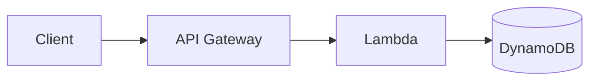

# Design: {{システム名}}

> requirements.md の各要件をどう実現するかの技術仕様。
> 憲法（AWS 前提 / サーバレス優先 / TDD）に従う。憲法から外れる判断は ADR を参照する。

## 1. アーキテクチャ概要

{{全体構成図。Mermaid で記述する}}

## 2. 技術スタック

| レイヤ | 選定 | 選定理由 | 検討した代替案 |
|--------|------|----------|----------------|
| 言語 / ランタイム | {{}} | {{}} | {{}} |
| コンピュート | {{Lambda など}} | {{}} | {{}} |
| データストア | {{DynamoDB など}} | {{}} | {{}} |
| IaC | {{AWS CDK など}} | {{}} | {{}} |
| テスト | {{フレームワーク}} | {{}} | {{}} |

## 3. コンポーネント設計

### 3.1 {{コンポーネント名}}

- **責務**: {{}}
- **対応要件**: REQ-xxx, REQ-yyy
- **インターフェース**: {{入出力・API シグネチャ}}
- **依存**: {{}}

## 4. データモデル

{{テーブル定義・キー設計・アクセスパターン}}

| テーブル | PK | SK | 属性 | アクセスパターン |
|----------|----|----|------|------------------|
| {{}} | {{}} | {{}} | {{}} | {{}} |

## 5. API / インターフェース定義

| メソッド | パス | 入力 | 出力 | 対応要件 |
|----------|------|------|------|----------|
| {{}} | {{}} | {{}} | {{}} | REQ-xxx |

## 6. エラーハンドリング

| 状況 | 振る舞い | 対応要件 |
|------|----------|----------|
| {{}} | {{}} | {{}} |

## 7. セキュリティ

- 認証・認可: {{IAM / Cognito など}}
- シークレット管理: {{Secrets Manager / SSM}}
- 最小権限: {{}}

## 8. コスト概算

| リソース | 想定利用量 | 月額概算 (USD) |
|----------|-----------|----------------|
| {{}} | {{}} | {{}} |
| **合計** | | {{}} |

## 9. テスト戦略

- ユニット: {{対象・モック方針}}
- 統合: {{DynamoDB Local / LocalStack / テストスタック}}
- E2E: {{対象ユースケース}}

## 10. 要件トレーサビリティ

| 要件 ID | 実現コンポーネント | 検証方法 |
|---------|-------------------|----------|
| REQ-001 | {{}} | {{}} |

## 11. 関連 ADR

- [ADR-0001](../adr/0001-{{slug}}.md): {{タイトル}}
